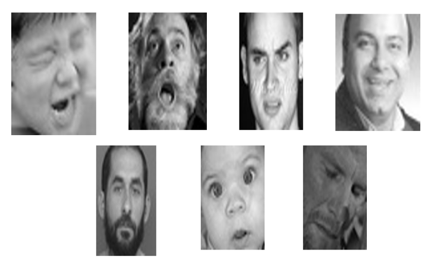
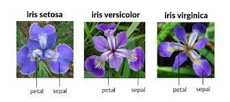
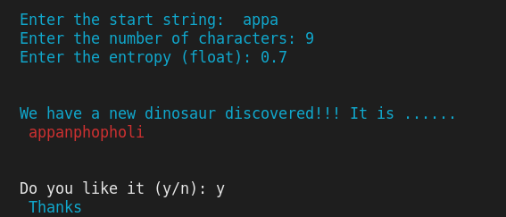

# ML and DL codes

## Deep Learning Codes
* [Emotion Detection and Arduino](#emotion-detection-and-arduino)
* [Sign Language Detection](#sign-language-detection)
* [Gesture Controlled LED](#gesture-control)

## Simple Classification using NN
* [Iris Classification](#iris-classification)
* [Character Level Language Model (CLL)](#cll-model)

# Emotion Detection and Arduino

 
 

 
This program makes use of the [FER 2013 dataset](https://www.kaggle.com/msambare/fer2013) for training and finally projects the output on a classic 16 X 2 character LCD intergrated with Arduino through PyFirmata library. [Click](https://pypi.org/project/pyFirmata/) for more info.
__*Code is contained here*__ [Emotion Detection](./Emotion_detection_arduino)

Check out this [video](https://youtu.be/5jIc0SWo5Kg)

# Sign Language Detection
This program uses the  [MNIST Sign Language](https://www.kaggle.com/datamunge/sign-language-mnist) Dataset. Individual training and test case represents a label (0-25) as a one to one map for each alphabetic letter A-Z .The training data (__27,455 cases__) and test data (__7172 cases__) are approximately half the size of the standard MNIST but otherwise similar with a header row of label, pixel1,pixel2.....pixel784 which represent a single 28x28 pixel image with grayscale values between 0-255.The provided data is of csv format
__*Code is contained here*__ [Sign Language Detection](./Sign_language_detection)

# Gesture Control

Index and thumb finger controlled LED using Arduino and Pyserial library

_**Code is contained here**_  [Gesture Control](./GestureControl)

# Iris Classification
This program aims at performing the task of classifying three different species of Iris flowers namely Versicolor,Setosa and Virginica. The [dataset](./Iris_Classification/iris.csv) contains 150 samples with 4 features being Petal Length, Petal Width, Sepal Length,Sepal Width.
 _Code_ [Iris](./Iris_Classification/Iris.py)
 
 # Iris Flowers
 

  
 

 

# CLL Model
This is a program which generates a funny and satiating dinosaur name with an initial start seed sentence and a temperature value.

_Code_ [CLL Model](./Character_Level_Language_Model)

  
 

 
### Setup and Usage:
* Clone this repository into your local machine
* Install the [required](./Character_Level_Language_Model/requirements.txt) packages using the command `pip install -r requirements.txt`
* Make sure that the model is downloaded into the same directory where it is cloned
* Run the [dinosaur](./Character_Level_Language_Model/dinosaur.py) script using the code `python dinosaur.py` in order to enter the interactive command line mode

 ### A sample output from the model 

 

  
 

 
 #### Note: Download the trained model by following the [kaggle](https://www.kaggle.com/suryaprakash0112358/dinosaur-model) link
